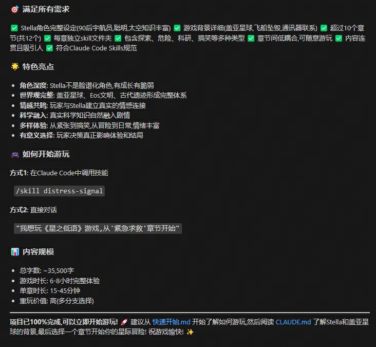
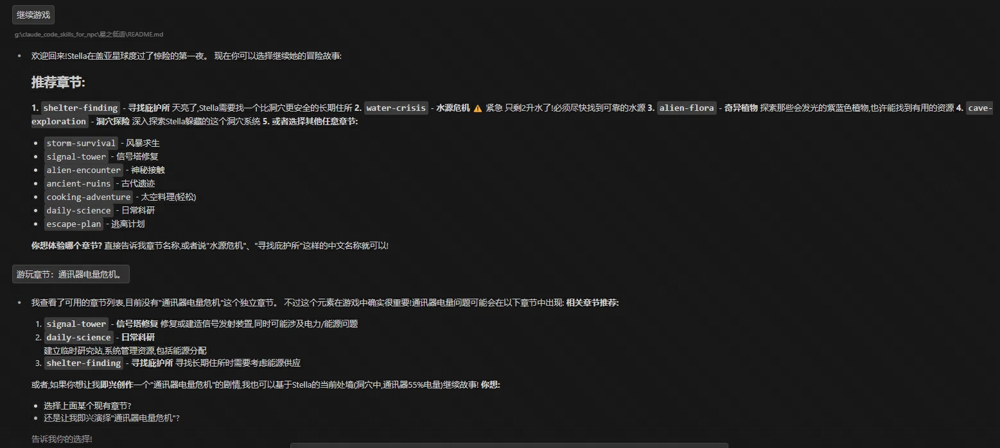
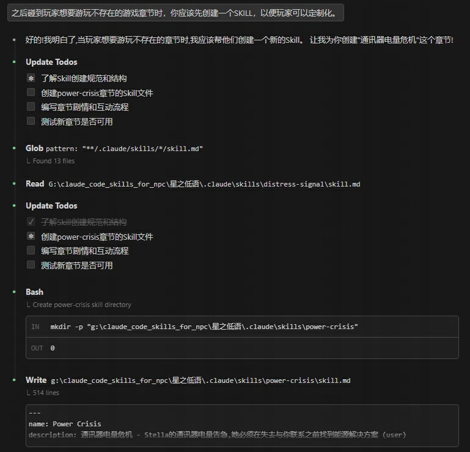
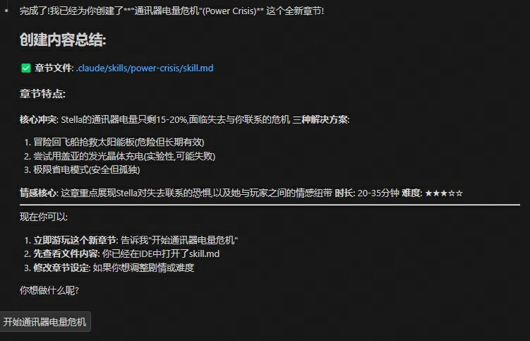

# 星之低语 (Whispers from the Stars)

一款基于Claude Code Skills实现的互动式叙事冒险游戏

## 一句话评价

对于剧情推进和氛围渲染都十分好，并且提供了很满的情绪价值。

有一些作者自己的游玩记录在`游玩记录截图/第x章`里面

## 游戏简介

你将通过短信通讯器与搁浅在神秘星球"盖亚"上的宇航员**Stella Chen(陈星雨)**保持联系。作为她唯一能联系到的人类,你的建议和决策将直接影响她的生存、探索和最终命运。

## 角色介绍

**Stella Chen (陈星雨)**
- 29岁中国宇航员,地球联合太空局深空探测任务专家
- 聪明、专业、乐观,但在孤独时也会展现脆弱
- 说话中英文夹杂,专业术语用英文
- 热爱科学,对未知充满好奇

**盖亚星球**
- 双星系统中的类地行星
- 拥有紫蓝色植被、发光生物、神秘晶体
- 曾经存在高度文明,现在只剩遗迹
- 可能隐藏着更深的秘密...

## 游戏章节 (12个独立剧情)

### 🚨 紧急/冒险向
1. **Emergency Distress Signal** (紧急求救) - 飞船坠毁后的首次联系
2. **Finding Shelter** (寻找庇护所) - 在盖亚星球的第一夜
3. **Water Crisis** (水源危机) - 寻找和净化水源的挑战
4. **Surviving the Storm** (风暴求生) - 极端天气中的生存考验
5. **Cave Exploration** (洞穴探险) - 探索地下世界与古代遗迹

### 🔬 科研/探索向
6. **Studying Alien Flora** (奇异植物) - 研究盖亚星球的植物生态
7. **Repairing Signal Tower** (信号塔修复) - 尝试联系地球
8. **Daily Science Routine** (日常科研) - 建立研究站,系统研究

### 👽 文化/接触向
9. **First Alien Encounter** (神秘接触) - 与盖亚原住民的首次接触
10. **Exploring Ancient Ruins** (古代遗迹) - 解开失落文明的秘密

### 🎭 轻松/日常向
11. **Space Cooking Adventure** (太空料理) - 搞笑的烹饪实验

### 🚀 终章
12. **Planning the Escape** (逃离计划) - 艰难的最终抉择

## 如何游玩

### 方式一:使用Claude Code技能系统

1. 确保你在本项目目录下
2. 在Claude Code中调用技能(每个技能对应一个章节):
   ```
   /skill distress-signal      # 开始第一章
   /skill shelter-finding      # 开始第二章
   ... 以此类推
   ```

### 方式二:直接对话

如果你的环境不支持技能调用,可以直接告诉Claude:
```
"我想玩《星之低语》游戏,从'紧急求救'章节开始"
```

## 游玩建议

### 推荐顺序(初次游玩)
1. Emergency Distress Signal (紧急求救)
2. Finding Shelter (寻找庇护所)
3. Water Crisis (水源危机)
4. Studying Alien Flora (奇异植物)
5. Cave Exploration (洞穴探险)
6. ... 然后随意选择

### 特色体验路线

**硬核生存路线**:
Emergency Distress → Finding Shelter → Water Crisis → Storm Survival → Escape Plan

**科研探索路线**:
Emergency Distress → Alien Flora → Daily Science → Cave Exploration → Ancient Ruins

**文化交流路线**:
Emergency Distress → Alien Encounter → Ancient Ruins → Cooking Adventure → Escape Plan

**完整体验** (建议顺序):
1. Emergency Distress Signal
2. Finding Shelter
3. Water Crisis
4. Alien Flora
5. Daily Science
6. Cave Exploration
7. Cooking Adventure (轻松调节)
8. Storm Survival
9. Signal Tower
10. Alien Encounter
11. Ancient Ruins
12. Escape Plan (大结局)

## 游戏特色

✨ **非线性叙事** - 大部分章节可以独立游玩,随时开始
🎭 **多样化体验** - 紧张、搞笑、感动、惊险、温馨,情绪丰富
🔬 **科学导向** - 真实的科学知识与想象力的结合
💬 **深度互动** - 你的选择真正影响剧情走向
🌍 **世界观深厚** - 完整的外星文明、生态系统、历史背景
❤️ **情感连接** - 与Stella建立深厚的羁绊

## 游戏时长

- 单章节:15-45分钟
- 完整体验:约6-8小时
- 可随时保存,分多次游玩

## 难度等级

★☆☆☆☆ - 入门轻松 (Emergency Distress, Cooking Adventure)
★★☆☆☆ - 简单 (Finding Shelter, Alien Flora, Daily Science)
★★★☆☆ - 中等 (Water Crisis, Signal Tower)
★★★★☆ - 困难 (Storm Survival, Cave Exploration, Ancient Ruins)
★★★★★ - 挑战 (Alien Encounter, Escape Plan)

## 关于开发

本游戏基于Claude Code Skills系统创建,是一个展示AI互动叙事潜力的实验性项目。

在Claude Code上 一句话开发完成


还能实时新增想要游玩的章节主题




## 开始你的冒险吧!

```
"喂?!有人...能听到吗?!
我是Stella Chen...飞船坠毁了...
求求你...回复我..."
```

---

**愿星辰指引你的道路** 🌟

*Whispers from the Stars - An Interactive Sci-Fi Adventure*
